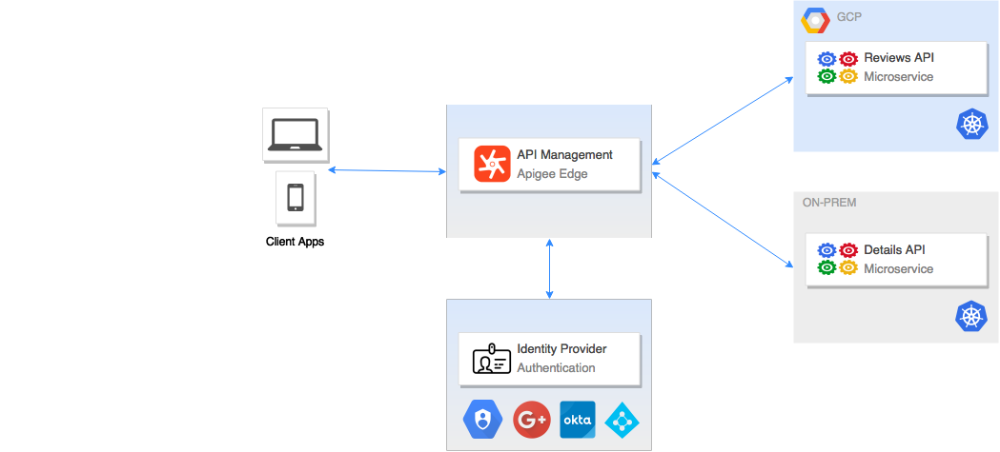

# Beer App
This application provides information about Beers in a simple interface. The application is comprised of a lightweight, responsive browser interface, a Beer Data API, and corespeonding Beer microservices. The Beer API is exposed through an API Management proxy endpoint point that enforces AuthN/AuthZ, Security, Rate limting, etc. The Beer API is constructed from various Beer microservices (Details, Reviews, etc.) that run in a Kubernetes (K8s) cluster. 

These are the initial deployment patterns:

* **Self-contained** application environment: The Beer API and services reside in a K8s environment (private or public cloud) and is proxied directly from the API Management platform.

* **Hybrid** private and/or public application environment: The Beer API services reside in separate or hybrid K8s environment(s) (private and public cloud) and the Beer API is orchestrated and proxied from the API Management platform.

The initial examples, **Self-contained** and **Hybrid**, focuses on running the Beer App services in [Google Kubernetes Engine](https://cloud.google.com/kubernetes-engine/). Additional examples will be provided for Minikube, Pivotal Cloud Foundry, etc. 

* [Prerequisites](#prerequisites)
* [Setup Frontend](#setup_frontend)
* [Setup Backend - Self-Contained](#setup_backend_self-contained)
* [Setup Backend - Hybrid](#setup_backend_hybrid)
* [API Management](APIGEE.md)
* [Development](DEVELOPMENT.md)
* [To-Do](#todo)

## Prerequisites:
* [Google Cloud Platform](https://cloud.google.com/) project created
* [Google Cloud Platform SDK](https://cloud.google.com/sdk/) installed and configured
* [Google Kubernetes Engine](https://cloud.google.com/kubernetes-engine/) cluster knowledge

* [Node](https://nodejs.org/en/) installed
* [Npm](https://www.npmjs.com/) installed

## Setup Frontend:
Install the Node packages via NPM (This will be added to a Docker development image in the future)

        cd frontend
        npm install

Build and run the development environment as a Node instance and Docker application locally. You can specify configuration variables if needed via command line.I.E. `CLIENT_ID=1234 npm run dev`. Make changes accordingly.

        npm run dev

Launch browser to UI:

        http://localhost:8080

## <a name="setup_backend_self-contained">Setup Backend - Self-contained</a>
Set your **CLUSTER_NAME** environment variable

        export CLUSTER_NAME=beer-app

Create a GKE multi-zone cluster with GKE alpha versions enabled:

        gcloud container clusters create $CLUSTER_NAME --zone=us-east4-a --additional-zones us-east4-b,us-east4-c --num-nodes=1 --cluster-version=1.9.2-gke.1 --enable-kubernetes-alpha

        gcloud compute instances list

Get the credentials for Kubectl:

        gcloud container clusters get-credentials $CLUSTER_NAME

Create the application and dependencies in the GKE cluster:

        kubectl create -f manifests/beer-app.yaml

Check the status:

        kubectl get deploy,po,svc -o wide

Get the external IP:

        kubectl get svc -l app=beer-api

Launch browser to view the API and OpenAPI Spec:

        http://{EXTERNAL-IP}:80/openapi_spec

You can now add an A/CNAME DNS record to the EXTERNAL-IP in Cloud DNS. _Integration of Cloud DNS into kubectl ToDo_

## <a name="setup_backend_hybrid">Setup Backend - Hybrid</a>
details-api:
Set your **CLUSTER_NAME** environment variable

        export CLUSTER_NAME=details-api

Create a GKE multi-zone cluster with GKE alpha versions enabled:

        gcloud container clusters create $CLUSTER_NAME --zone=us-east4-a --additional-zones us-east4-b,us-east4-c --num-nodes=1 --cluster-version=1.9.2-gke.1 --enable-kubernetes-alpha

        gcloud compute instances list

Get the credentials for Kubectl:

        gcloud container clusters get-credentials $CLUSTER_NAME

Create the application and dependencies in the GKE cluster:

        kubectl create -f manifests/beer-app_details.yaml

Check the status:

        kubectl get deploy,po,svc -o wide

Get the external IP:

        kubectl get svc -l app=details-api

Launch browser to view the API and OpenAPI Spec:

        http://{EXTERNAL-IP}:80/details

reviews-api:
Set your **CLUSTER_NAME** environment variable

        export CLUSTER_NAME=reviews-api

Create a GKE multi-zone cluster with GKE alpha versions enabled:

        gcloud container clusters create $CLUSTER_NAME --zone=us-east4-a --additional-zones us-east4-b,us-east4-c --num-nodes=1 --cluster-version=1.9.2-gke.1 --enable-kubernetes-alpha

        gcloud compute instances list

Get the credentials for Kubectl:

        gcloud container clusters get-credentials $CLUSTER_NAME

Create the application and dependencies in the GKE cluster:

        kubectl create -f manifests/beer-app_reviews.yaml

Check the status:

        kubectl get deploy,po,svc -o wide

Get the external IP:

        kubectl get svc -l app=reviews-api

Launch browser to view the API and OpenAPI Spec:

        http://{EXTERNAL-IP}:80/reviews

You can now add an A/CNAME DNS record to the EXTERNAL-IP in Cloud DNS. _Integration of Cloud DNS into kubectl ToDo_

## <a name="todo">To Do!</a>
* Frontend has not been containerized and ported to K8s yet. Manual installation required for now...
* Add Cloud DNS A/CNAME record creation in app 
