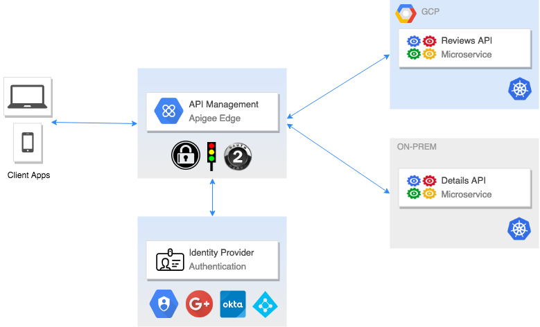

# Beer App
## <a name="overview">Overview</a>
This application provides information about beer data in a simple interface. The application is comprised of a lightweight, responsive browser interface, a Beer Data API, and corresponding Beer microservices. The Beer API is exposed either through an API Management proxy endpoint or Istio ingress point with Apigee Edge enforcing AuthN/AuthZ, Security, Quota, Rate limting, etc. The Beer API is constructed from various Beer microservices (Details, Reviews, Likes, etc.) that run in a Kubernetes (K8s) cluster. Istio is installed in the K8s cluster to provide service mesh management by leveraging Envoy as a sidecar proxy. Istio provides traffic management, observability, policy enforcement, and security (mTLS) for the cluster services. The Apigee Istio Mixer plugin provides additional security and governance with api key/token validation, quota enforcement, and analytics.

### <a name="deployment_patterns">Deployment Patterns</a>
These are the API Management deployment patterns:

* **Edge Proxy** environment: The Beer API and services reside in a K8s environment (private or public cloud) and are proxied directly from the API Management Edge proxy. This is the default example.

* **Mesh Proxy** environment: The Beer API and services reside in a K8s environment (private or public cloud) and are proxied directly from the Istio/Envoy sidecar proxies. This is the Apigee Istio Mixer example.

* **Facade Proxy** environment: The Beer API services reside in separate K8s environment(s) (private and public cloud) or namespaces and the Beer API is orchestrated and proxied from the API Management platform.

### <a name="backend_servicess">Backend Services</a>
The Beer App API and coresponding backend services are polyglot in nature to showcase how various technologies can be utilized for modern application development. The backend service's datastores are traditional relational and non-relational databases to highlight how they can be easliy swapped for a cloud-based managed dataservice.

The Beer App services and source respositories are below:

| Service                                              | Language      | Description                                                                                                                       |
| ---------------------------------------------------- | ------------- | --------------------------------------------------------------------------------------------------------------------------------- |
| [beer-app-frontend](./frontend)                           | VueJS      | A lightweight, responsive browser interface to showcase the application. |
| [beer-api](./backend)                     | Python            | The Beer API orchestrates the coresponding backend microservice calls and retrieves data for the consuming clients. |
| [details-api](https://github.com/phriscage/beer-details) | Python       | This service provides _details_ about a single or collection of beers. |
| [details-db](https://github.com/phriscage/beer-details) | MySQL       | This is the backend relational datastore for the beer details. |
| [reviews-api](https://github.com/phriscage/beer-reviews) | Go       | This service provides _reviews_ about a single or collection of beers. |
| [reviews-db](https://github.com/phriscage/beer-reviews) | Elasticsearch       | This is the backend non-relational, document datastore for the beer reviews. |
| [likes-api](https://github.com/phriscage/beer-likes) | Go       | This service provides _likes_ about a single or collection of beers. |

### <a name="architecture">Architecture</a>
The architecture diagram below outlines the different types of consumers and services in the cluster. The communication path for the client requests will be determined by Istio virtual service [request routing](https://istio.io/docs/tasks/traffic-management/request-routing/) via headers or access token claims.

## <a name="prerequisites">Prerequisites</a>
There are a few [prerequisites](docs/PREREQUISITES.md) that need to be validated and/or installed before continuing to the setup. The [Setup](docs/SETUP.md) contains all the commands required to setup the environment to run the demo and labs.

* [Prerequisites](docs/PREREQUISITES.md)
* [Setup](docs/SETUP.md)
* [Labs!](labs/)
* [Development](docs/DEVELOPMENT.md)
* [To-Do](#todo)

## <a name="todo">To Do!</a>
* ~~Frontend has not been containerized and ported to K8s yet. Manual installation required for now...~~ updated
* Add Cloud DNS A/CNAME record creation in app
