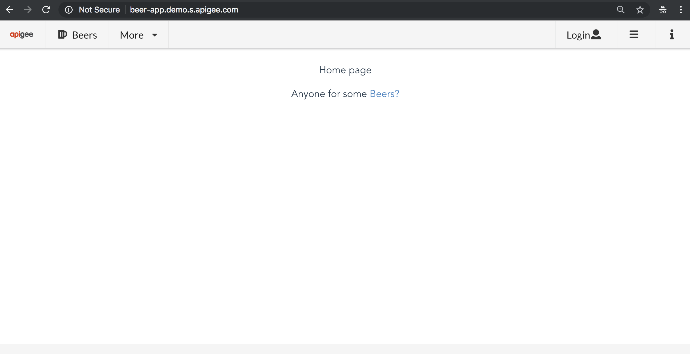

# Beer App - Setup
This documentation provides details for how to setup the Beer App interface and API. You will need to create a K8s cluster, install the application and start the front-end client

* [Setup Kubernetes](#setup_kubernetes)
* [Setup Istio](#setup_istio)
* [Setup App](#setup_app)
* [Setup Frontend](#setup_frontend)
* [Cleanup](#cleanup)

## <a name="setup_kubernetes">Setup Kubernetes</a>
These instructions to setup a k8s environment via the *gcloud* SDK CLI. You can also setup via the GCP *console*.

Set your **CLUSTER_NAME** environment variable

        export CLUSTER_NAME=beer-app

Create a GKE cluster via *gcloud* CLI and verify the instances are created:

        gcloud container clusters create $CLUSTER_NAME --zone=us-east4-a --num-nodes=4 --cluster-version=1.10

        gcloud compute instances list

Enable cluster-admin-binding clusterrolebinding in the cluster:

        kubectl create clusterrolebinding cluster-admin-binding --clusterrole=cluster-admin --user=$(gcloud config get-value core/account)

## <a name="setup_istio">Setup Istio</a>
These instructions to setup Istio via the *gcloud* SDK CLI

Install Istio with mTLS (between Istio components) and with Apigee Istio Mixer image:

        kubectl apply -f install/kubernetes/istio-demo-auth.yaml

## Setup App:
Create the application and inject the Istio sidecar proxies to the application Pods. There are a few baseline applications that are defined in the [kubernetes-manifests/beer-app](kubernetes-manifests/beer-app) directory. Depending on your demo/lab, you will start with the appropriate one. If unsure, you can default to [beer-app_all.yaml](kubernetes-manifests/beer-app/beer-app_all.yaml)
* [beer-app_all.yaml](kubernetes-manifests/beer-app/beer-app_all.yaml) configuration has all services and versions

        kubectl create -f <(istioctl kube-inject -f kubernetes-manifests/beer-app/beer-app_all.yaml)

Enable mTLS policy for the default namespace. You can verify with `kubectl get policy`:

        kubectl apply -f istio-manifests/beer-app/networking/mtls_default_policy.yaml

Apply the destination rules for all the services:

        kubectl apply -f istio-manifests/beer-app/networking/destination-rule-all.yaml

Create the Ingress Gateway for the application which includes both the Beer API and Beer App Frontend. You can verify with `kubectl get gateway` and `kubectl get virtualservice`:

        kubectl apply -f istio-manifests/beer-app/networking/beer-app_gateway.yaml
        kubectl apply -f istio-manifests/beer-app/networking/beer-app-frontend_gateway.yaml

Check the status of the deployment and get external ingress IP:

        kubectl get gateway,virtualservice,deploy,po,svc -o wide
        kubectl -n istio-system get service istio-ingressgateway

Export the external ingress IP as GATEWAY_URL=<IP:PORT>:

        export GATEWAY_URL=`kubectl -n istio-system get service istio-ingressgateway -o jsonpath='{.status.loadBalancer.ingress[0].ip}'`

Verify an Ok 200 HTTP status code is returned when trying to access the Beer API service:

        curl -o /dev/null -s -w "%{http_code}\n" http://${GATEWAY_URL}/api/health

## Setup Frontend:
Launch a modern browser with the http://${GATEWAY_URL} URL and the Beer App Frontend will load:
> You can now add an A/CNAME DNS record to the GATEWAY_URL in Cloud DNS. _Integration of Cloud DNS into kubectl ToDo_

Click on the settings tab and add the http://${GATEWAY_URL}/api or http://CNAME/api in the *Beers API Base UURL* field, and click *Save*

Navigate to the *Beers* tab and you will see a list of beers:

## Next:

* Try some of the [labs](../labs)
* [Setup the Mesh Proxy](SETUP-MESH-PROXY.md)

## Cleanup:
Let's cleanup everything for a fresh start

        kubectl delete -f istio-manifests/beer-app/networking/beer-app_gateway.yaml
        kubectl delete -f istio-manifests/beer-app/networking/beer-app-frontend_gateway.yaml
        kubectl delete -f istio-manifests/beer-app/networking/destination-rule-all.yaml
        kubectl delete -f istio-manifests/beer-app/networking/mtls_default_policy.yaml
        kubectl delete -f kubernetes-manifests/beer-app/beer-app_all.yaml
