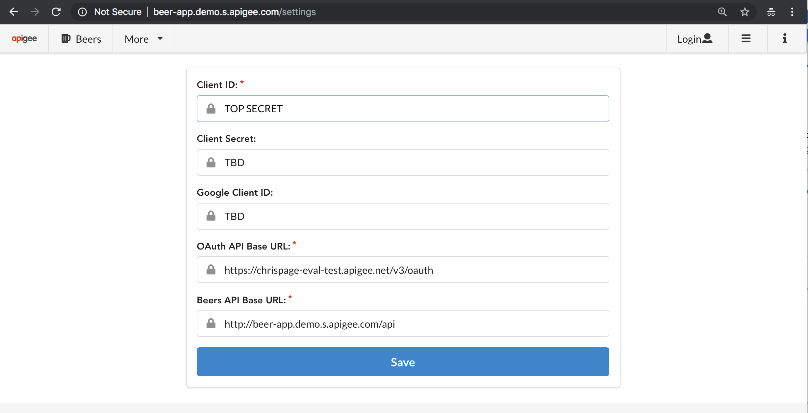
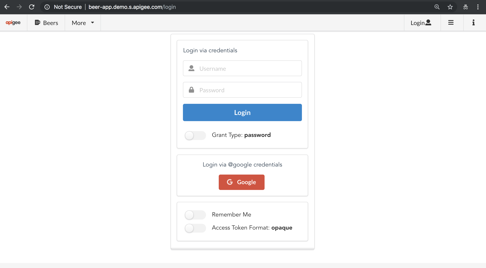

# Beer App Labs - Mesh Beer App Frontend Demo
This documentation provides details for Running the Beer App Frontend Demo lab.

Please verify that you have read and completed the follow documents before continuing the Lab exercises:

[prerequisites](../docs/PREREQUISITES.md)
[Setup](../docs/SETUP.md)
[Setup Mesh Proxy](../docs/SETUP-MESH-PROXY.md)

Enable all the Beer App services to route to *v1* via the [virtual-service-all-v1.yaml](istio-manifests/beer-app/networking/virtual-service-all-v1.yaml) file. This changes all VirtualService destinations to be *v1*. _Note_ Beer App VirtualService needs to bind to the Ingress Gateway.

        kubectl apply -f istio-manifests/beer-app/networking/virtual-service-all-v1.yaml
        
Dynamically route the *@google.com* authorized users to route to *v2* of the Beer API via the [virtual-service-beer-api-google.com-v2.yaml](istio-manifests/beer-app/networking/virtual-service-beer-api-google.com-v2.yaml). This file changes the Beer App VirtualService destinations for Beer API to be *v2* for any *@google.com* email claim.

        kubectl apply -f istio-manifests/beer-app/networking/virtual-service-beer-api-google.com-v2.yaml
        
Login to the Beer Developer Portal or Apigee Edge Management UI and create an application with access to a Beer App API Product(s) and capture the client ID.
Launch the Beer App Frontend in your browswer, click the *settings* icon in the top right, modify the *Clien
t ID*, and click *Save*

Add the *OAuth API Base URL* from the OAuth provider or the Apigee Edge instance and click *Save* 

Click on the *login* and login with any username/password combination and token format. After successful token, you will be redirect to the user acount profile:

Navigate to the *Beers* tab and you will see a list of beers:

Click on the *login* and logout/login with *@google.com* username/password combination and token format. After successful token, you will be redirect to the user acount profile:

Navigate to the *Beers* tab and you will see a list of beers with likes:

Open the Apigee Edge analytics to view the errors and success for the service proxies.

## Clean up

        kubectl delete -f istio-manifests/beer-app/networking/virtual-service-beer-api-google.com-v2.yaml
        kubectl delete -f istio-manifests/beer-app/networking/virtual-service-all-v1.yaml
